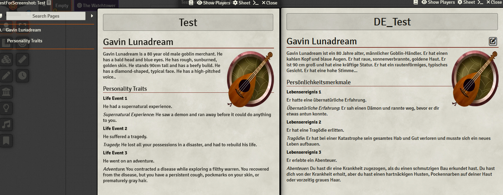

# What is Comprehend Languages

Comprehend languages leverages the Deepl API to automatically translate Foundry Journal Entries from English into a language of your choice. In the process, a new journal entry is created that contains the translated text. The module was created specifically with [PDF to Foundry](https://gitlab.com/fryguy1013/pdftofoundry) in mind to help automatically translate adventure description text into the GM's native language.

# How does it work?

A bit of setup work is required before the module functions. You need to create a DeepL API Free account at [Deepl.com](https://www.deepl.com/pro#developer). The Free account should give you way more translated characters than you should need (500.000 characters/month). Unfortunately, a credit card (that will not be charged unless you upgrade to a Pro account) is required for the account creation process.
After setting up your account, go into your DeepL account settings and copy the "Authentication Key for DeepL API".

After enabling the module in your world, open the Module Settings and paste the API Key into the **DeepL Token** input field. Here you can also set your preferred target language.

Now you are good to go. When opening a Journal Entry, a new button appears in the header only for the GM (**Translate**). Click on that button and after a few seconds (depending on the length of the text) a new JournalEntry will be created which is called _xx_OldName_. XX is a two letter abbreviation for your target language.

At this moment, the module strips the text of all formatting. If there is enough interest in the module, persisting formatting/HTML of the input text will be one of the first new features.

Please also be aware that this is a very rudimentary implementation at the moment (ship early, I guess?). Bugs WILL happen and there is almost no error handling yet. If it does not work, please check that your token is correct.

## Changelog
