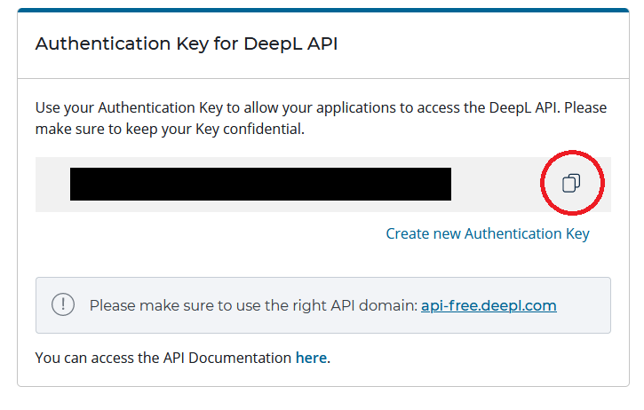

 [](https://forge-vtt.com/bazaar#package=harvester)

# Comprehend Languages

Comprehend languages leverages the Deepl API to automatically translate Foundry Journal Entries & (some) item descriptions from English into a language of your choice. In the process, a new journal entry is created that contains the translated text. The module was created specifically with [PDF to Foundry](https://gitlab.com/fryguy1013/pdftofoundry) in mind to help automatically translate adventure description text into the GM's native language.

# How does it work?

A bit of setup work is required before the module functions. You need to create a DeepL API Free account at [Deepl.com](https://www.deepl.com/pro#developer). The Free account should give you way more translated characters than you should need (500.000 characters/month). Unfortunately, a credit card (that will not be charged unless you upgrade to a Pro account) is required for the account creation process.
After setting up your account, go into your DeepL account settings and copy the "Authentication Key for DeepL API".



After enabling the module in your world, open the Module Settings and paste the API Key into the **DeepL Token** input field. Here you can also set your preferred target language.


Now you are good to go. When opening a Journal Entry or Item, a new button appears in the header only for the GM (**Translate**). Click on that button and after a few seconds (depending on the length of the text) a new JournalEntry or Item will be created which is called _xx_OldName_. XX is a two letter abbreviation for your target language. Optionally you can also enable a setting that saves all translated entries into their own folder.


The module retains HTML formatting.

If you find any issues, feel free to contact me directly or file an issue here on GitHub.

# Hotkey Translation of Selected Text

The module also lets you translate selected text via hotkey (default: Alt+T, configurable in the Controls section of Foundry). Simply select any text in a JournalEntry, Item description or even in the chat, press the hotkey and a Dialog with your translation will open shortly. These translations are not persisted. As soon as you close the Dialog, they are gone.

## Installation

It's always easiest to install modules from the in game add-on browser.

To install this module manually:
1.  Inside the Foundry "Configuration and Setup" screen, click "Add-on Modules"
2.  Click "Install Module"
3.  In the "Manifest URL" field, paste the following url:
`https://raw.githubusercontent.com/p4535992/foundryvtt-comprehend-languages/master/src/module.json`
4.  Click 'Install' and wait for installation to complete
5.  Don't forget to enable the module in game using the "Manage Module" button

# Build

## Install all packages

```bash
npm install
```

### dev

`dev` will let you develop your own code with hot reloading on the browser

```bash
npm run dev
```

### build

`build` will build and set up a symlink between `dist` and your `dataPath`.

```bash
npm run build
```

### build:watch

`build:watch` will build and watch for changes, rebuilding automatically.

```bash
npm run build:watch
```

### prettier-format

`prettier-format` launch the prettier plugin based on the configuration [here](./.prettierrc)

```bash
npm run-script prettier-format
```

### lint

`lint` launch the eslint process based on the configuration [here](./.eslintrc.json)

```bash
npm run-script lint
```

### lint:fix

`lint:fix` launch the eslint process with the fix argument

```bash
npm run-script lint:fix
```

### build:json

`build:json` unpack LevelDB pack on `src/packs` to the json db sources in `src/packs/_source`very useful for backup your items and manually fix some hard issue with some text editor

```bash
npm run-script build:json
```

### build:clean

`build:clean` clean packs json sources in `src/packs/_source`. NOTE: usually this command is launched after the command `build:json` and after make some modifications on the json source files with some text editor, but before the `build:db`

```bash
npm run-script build:clean
```

### build:db

`build:db` packs the json db sources in `src/packs/_source` to LevelDB pack on `src/packs` with the new jsons. NOTE: usually this command is launched after the command `build:json` and after make some modifications on the json source files with some text editor

```bash
npm run-script build:db
```

## [Changelog](./CHANGELOG.md)

## Issues

Any issues, bugs, or feature requests are always welcome to be reported directly to the [Issue Tracker](https://github.com/p4535992/foundryvtt-comprehend-languages/issues)

## Licenses

This package is under an [MIT](LICENSE) and the [Foundry Virtual Tabletop Limited License Agreement for module development](https://foundryvtt.com/article/license/).

## Credit